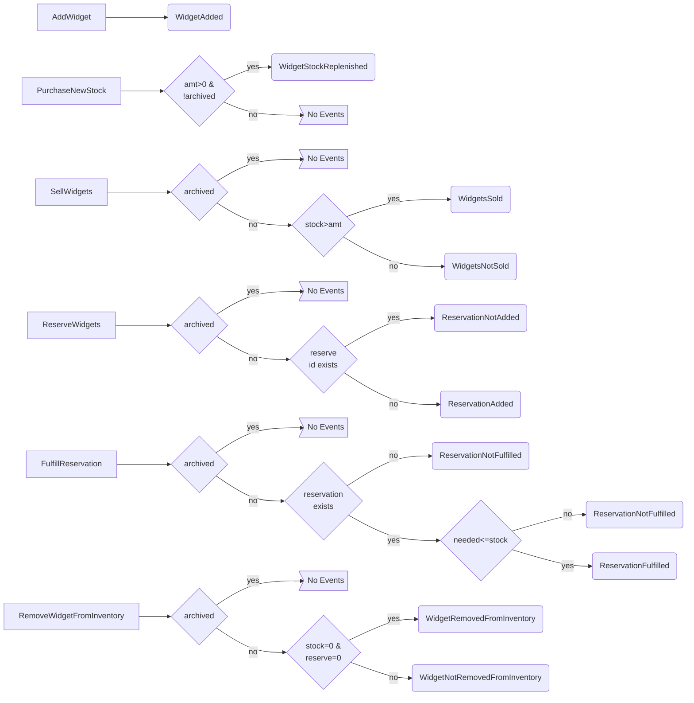
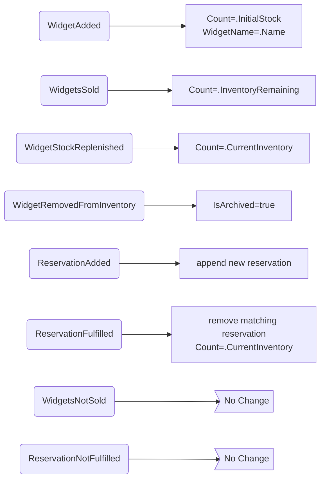

# Sample Entity: Widget

This folder contains everything needed to demonstrate a sample entity.

## Commands/ and Events/
These directories contain all of the events and commands for
the entity. They are all immutable record types, and all very
simple. Adding new behavior requires creating a new command and
corresponding event(s). Once these are created, the `Decider.Decide`
method should be updated to check the state and command to
generate the new events; the `Decider.Evolve` method should be
updated to take the events and transition the state.

## Views/
Each view is made up of two parts -- the view object itself, which
is an immutable record (or record structure), and the aggregator,
which takes the event stream and updates the view object. The
three views in this sample are defined as `SingleStreamAggregation`s,
which you can read about in the [Marten Documentation](https://martendb.io/events/projections/aggregate-projections.html).

## Configure.cs
There is a single extension method for `IServiceCollection` that 
registers all of the necessary services for the entity. It also
configures the Marten projections.

From Program.cs, call `builder.Services.AddWidget();`

The `AddWidget` method is made up of two main parts. The first part
registers all of the services needed for the entity to exist.

For each entity, both a `Decider<TIdentity, TState>` and `Evolver<TIdentity, TState>`
need to be registered. In this example, since `Decider` is derived from `Evolver`, these 
are the same object, `WidgetDecider.Decider`. These should be singleton since
neither of them should ever depend on external service, i.e. Functional Core.

Next, the command handler, `WidgetCommandHandler` is registered. This
is a scoped dependency since we want a single DB session per HTTP request.
The `WidgetData` object is registered next. This contains all of the methods
needed to access the events and projections. In this case, it is derived from
`MartenData` with a `TState` of `Widget`.

The command handler needs both a loader and at least on saver
defined. These come from `WidgetData` and are resolved by
finding the service and returning the appropriate method.

The rest of the configuration is related to projections (in the
Views folder). On the Widget page, we need to see both the
available widgets and the current sales for all widgets. These
views are handled by the `AvailableWidget` and `TotalWidgetsSold`
projections, respectively. Since we only ever need all of the values
of these projections, we register `GetAll<TProjection>` methods
in the DI container. Both delegates are in the `WidgetData` class.

The `WidgetReservationDetail` is used per identity, so it has a
`Find<TIdentity, TProjection>` service defined. The implementaion is
also in the `WidgetData` class.

Finally, Marten is configured to produce the projections and some
metadata is defined for each of the view types.

---

A second method defined in `Configuration` is to add the Widget minimal API to
the application. It's a simple method that takes a widget id and
the Find method for the `WidgetReservationDetail` view and returns
what it finds as JSON.

## Widget.cs
This contains the state object for the entity. It is only used
during command handling. In this sample, the Widget is an
immutable record class. It's possible to use a mutable class (or record)
for memory efficiency. You can also choose to save the current
state instead of the event stream. Everything will work just
the same, but you'll have to make use of a different Saver and
Loader.

## WidgetCommandHandler.cs
This is the *Imperative Shell* part of the Widget entity. It extends
the `EntityCommandHandler` abstract class, simply passing in 
the Decider from WidgetDecider.cs; and the Loader and Saver, both from WidgetData.cs.
This entity does not use an Archiver.

To execute a command, inject a `WidgetCommandHandler` into your
page (or page handler), controller (or controller action), or
minimal API, and call the `Handle` method passing the identity
(a `Guid`) and an instance of the desired command.

*All of the work below happens in the base class.*

The handler first trys to load the entity using the `Loader` from the given
identity and checks if the command being executed is an initiator/creator.

The handler will then do one of three things:
1. If the command is an initiator and an entity with the given id already exists, it will throw an exception indicating this condition.
2. If the command is not an initiator and the entity with the given id doesn't exist, it will throw an exception indicating this condition.
3. Otherwise, it will call the Decider `Handle` method which returns the new state and the events.

(As a short circuit, if no events occurred, the handler returns the state and empty event list immediately.)

The handler calls each `Saver` in the order in which they
were registered in the DI container (if using the default container; this may be different with other containers).

If the state is a terminal state, the `Archiver` will be invoked.

At this point the new state and events are returned; these can
both be used in the calling method to determine next steps or 
if an error occurred, etc.

## WidgetData.cs
This is the data access class for the Widget entity. It extends
MartenData, which provides the event streamed Load and Save
methods (used by WidgetCommandHandler). The additional methods
defined in this class are related to projections/views.

## WidgetDecider.cs
This contains the Decider/Evolver for the Widget entity. The actions
needed to implement the business logic for this entity all exist in
this one file. Commands are executed or not based on the command
definition and the current state of the entity, producing a stream
of events. Those events are then folded into the current state using
the evolver, returning a new state.

This class represents the *Functional Core* of the entity. All of the
methods defined here are Pure functions.

### Business logic implemented

#### Decide

#### Evolve

